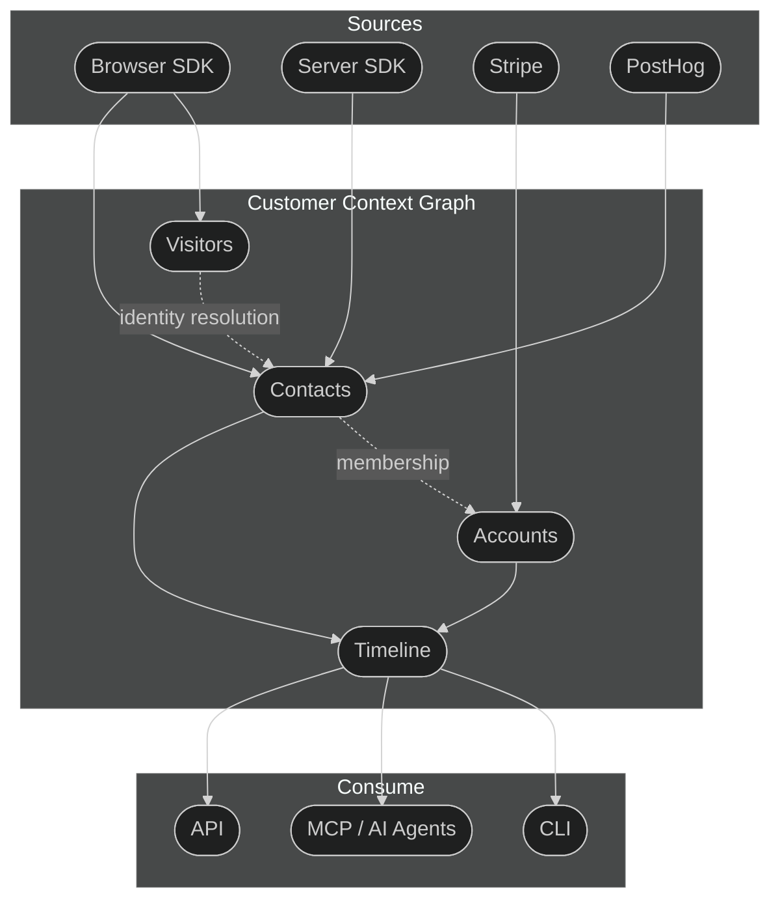

The customer context graph is Outlit's unified data model. It connects every customer interaction — website visits, product usage, billing events, support conversations — into a structured graph of entities and relationships. Instead of customer data scattered across Stripe, PostHog, your app database, and email, the graph gives you (and your AI agents) one place to query the complete picture.

## What is the customer context graph?

The customer context graph is a structured representation of everything Outlit knows about your customers. It has four layers:

1. **Entities** — The people and companies you do business with: anonymous visitors, known contacts, customer accounts, and devices
2. **Relationships** — How entities connect: identity resolution links, account membership, cross-device associations
3. **Activity timeline** — A chronological log of every interaction from every source: pageviews, form submissions, Stripe charges, Slack messages, email threads, call transcripts
4. **Facts** — Temporal assertions about each customer that capture *what it means*, not just what happened: churn risk signals, expansion opportunities, competitive evaluations, champion changes, and more

## How does Outlit build the graph?

Outlit builds the customer context graph in four stages:

### 1. Collect

Data flows in from multiple sources:

| Source | What it captures | How to connect |
|--------|-----------------|----------------|
| **Browser SDK** | Pageviews, form submissions, engagement time, UTM attribution, company enrichment | Add the Outlit script or npm package to your site |
| **Server SDK** | Backend events (API calls, exports, notifications) | Use the Node.js or Rust SDK |
| **Stripe** | Subscriptions, charges, billing status changes | Connect via [dashboard](https://app.outlit.ai/integrations) |
| **PostHog** | Product usage sessions and feature engagement | Connect via [dashboard](https://app.outlit.ai/integrations) |
| **Slack** | Messages, reactions, thread context | Connect via [dashboard](https://app.outlit.ai/integrations) |
| **Gmail** | Email threads, sender history | Connect via [dashboard](https://app.outlit.ai/integrations) |
| **Fireflies.ai** | Call transcripts, action items, summaries | Connect via [dashboard](https://app.outlit.ai/integrations) |
| **Google Calendar** | Meetings, attendees, scheduling patterns | Connect via [dashboard](https://app.outlit.ai/integrations) |
| **Supabase Auth / Clerk** | User identity, sign-up source, auth events | Connect via [dashboard](https://app.outlit.ai/integrations) |

<Info>
  We recommend the Outlit browser SDK as your primary data source — it's the only way to get [website visitor tracking](/concepts/website-visitors) (anonymous visits, form auto-identification, and pre-signup attribution). PostHog is a great complement for product usage data, but it won't capture the anonymous visitor journey.
</Info>

### 2. Resolve

[Identity resolution](/concepts/identity-resolution) links activity to real people. When a visitor submits a form, signs up, or logs in, Outlit connects their anonymous browsing history to their profile. The same person on different devices gets merged into one contact.

### 3. Connect

Entities form relationships:
- **Visitors → Contacts**: Via identity resolution (email, userId, device fingerprint)
- **Contacts → Accounts**: Via email domain matching and explicit association
- **Accounts → Billing**: Via Stripe integration or manual status updates

Each contact carries a [journey stage](/concepts/customer-journey) (Discovered → Signed Up → Activated → Engaged → Inactive) and each account carries a billing status (None → Trialing → Paying → Churned).

### 4. Query

The graph is queryable through multiple interfaces:

- **[CLI](/cli/overview)** — `outlit customers list`, `outlit search "..."`, `outlit sql "..."`
- **[MCP](/ai-integrations/mcp)** — AI agents query customer context directly in Cursor, Claude Code, VS Code
- **[API](/api-reference/introduction)** — Programmatic access for custom integrations

## What makes this different from a CRM or analytics tool?

Traditional tools capture one slice of the customer relationship:

| Tool type | What it knows | What it misses |
|-----------|--------------|----------------|
| Web analytics | Anonymous pageviews | Who the visitor becomes |
| Product analytics | Authenticated user sessions | Pre-signup journey |
| CRM | Deal stages and contacts | Actual product usage |
| Billing | Payment events | Everything before payment |

Outlit's graph connects all of these — and goes further with **facts**. Instead of just showing raw data, a query like `outlit customers get acme.com --include timeline,facts` shows the complete story *with reasoning*: which pages Acme's team viewed before signing up, how they used the product after onboarding, what their billing trajectory looks like, and what it all means — churn risk signals, expansion opportunities, champion changes, and competitive context.

## How do facts work?

Facts are temporal assertions that Outlit maintains about each customer. While the activity timeline records *what happened*, facts capture *what it means* — the reasoning layer that makes the graph intelligent.

Outlit generates facts from three sources:

| Source | What it captures | Example |
|--------|-----------------|---------|
| **Behavioral** | Automatically detected from activity patterns | "Core feature usage declined 40% over 14 days" |
| **Extracted** | Parsed from Slack, email, and call transcripts | "Customer mentioned evaluating a competitor in #support channel" |
| **Synthesized** | Correlated from multiple observations | "Key contact went quiet + competitor mention + declining usage = churn risk" |

Every fact has **temporal validity** — it knows when it became true and when it stops being relevant. As new activity flows into the graph, facts are automatically validated or invalidated. A "contract renews in March" fact expires after March. A "customer is evaluating competitors" fact gets resolved when they renew. This means the graph always reflects the *current* state of each customer relationship, not stale snapshots.

Facts are queryable through the same interfaces as the rest of the graph — CLI, MCP, and API.

## How do journey stages fit into the graph?

Journey stages are properties on graph nodes — structured labels that Outlit maintains as contacts and accounts progress:

- **Contact journey stages** (Discovered, Signed Up, Activated, Engaged, Inactive) describe where each person is in their product engagement
- **Account billing statuses** (None, Trialing, Paying, Churned) describe the commercial relationship

Some stages are inferred automatically from integrations. The Outlit browser SDK auto-detects Discovered and Signed Up based on the identifiers provided. Engaged and Inactive are auto-inferred from product activity via PostHog or your SDK (browser or server). Activated is the one stage you instrument manually — since the definition of "activated" is specific to your product, you call `user.activate()` when a contact completes your onboarding or key milestone.

Billing statuses update automatically when Stripe is connected.

For full details, see [Customer Journey](/concepts/customer-journey).

---

## Frequently Asked Questions

<AccordionGroup>
  <Accordion title="Do I need all the integrations to use Outlit?">
    No. The browser SDK alone gives you website visitor tracking, identity resolution, and journey stages. Each additional integration (Stripe, PostHog, server SDK) adds more signal to the graph, but none are required to get started.
  </Accordion>

  <Accordion title="How is the graph different from a data warehouse?">
    A data warehouse stores raw events. The customer context graph is entity-resolved and relationship-mapped — it knows that visitor abc-123, user jane@acme.com, and Stripe customer cus_456 are the same person at the same company, and it maintains that structure automatically.
  </Accordion>

  <Accordion title="Can AI agents access the full graph?">
    Yes. The [MCP integration](/ai-integrations/mcp) exposes the graph to AI agents in Cursor, Claude Code, Claude Desktop, VS Code, and other supported environments. Agents can list customers, get timelines, search context, and run SQL queries.
  </Accordion>

  <Accordion title="How quickly does new data appear in the graph?">
    Browser and server SDK events appear within seconds. Stripe webhook events appear within minutes. PostHog syncs run on a configurable schedule.
  </Accordion>
</AccordionGroup>

---

## Next Steps

<CardGroup cols={2}>
  <Card title="Quick Start" icon="rocket" href="/tracking/quickstart">
    Install the CLI and start building your graph in 5 minutes
  </Card>
  <Card title="Customer Journey" icon="route" href="/concepts/customer-journey">
    Understand journey stages and billing statuses
  </Card>
  <Card title="Identity Resolution" icon="fingerprint" href="/concepts/identity-resolution">
    How Outlit links visitors to known contacts
  </Card>
  <Card title="Website Visitors" icon="globe" href="/concepts/website-visitors">
    What Outlit captures before visitors identify themselves
  </Card>
</CardGroup>
