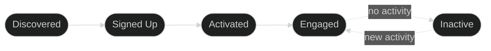
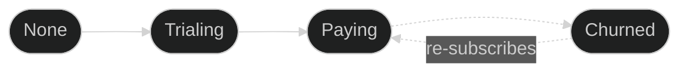

Outlit tracks two independent dimensions of your customer relationships as part of the [customer context graph](/concepts/customer-context-graph): **contact journey** (how engaged each person is) and **account billing** (the commercial relationship). These are separate because a contact can be highly engaged while their company hasn't paid yet, or a company can be paying while a specific team member is inactive.

## How does Outlit model the customer journey?

Outlit tracks contacts and accounts separately:

### Contact Journey (per person)



### Account Billing (per company)



---

## What are the contact journey stages?

Each person (contact) progresses through stages based on their product engagement:

| Stage | Meaning | How It's Set |
|-------|---------|--------------|
| **Discovered** | Email known, hasn't signed up yet | Auto-detected by browser SDK when email is provided without userId |
| **Signed Up** | Created an account | Auto-detected by browser SDK when both email and userId are provided |
| **Activated** | Completed onboarding or key milestone | Manual — call `user.activate()` |
| **Engaged** | Actively using the product | Auto-inferred from product activity via PostHog or your SDK (browser/server) |
| **Inactive** | No activity for extended period | Auto-inferred when no activity detected for 30+ days |

<Info>
  Contact stages track **product engagement**, not billing. A contact can be Engaged even if their company hasn't paid, or Inactive even if their company is actively paying.
</Info>

### How stages progress

Contacts move forward through Discovered, Signed Up, Activated, and Engaged. They can never move backwards—an Engaged contact can't become Activated again. The one exception is Inactive: contacts automatically return to Engaged when they have new activity.

---

## How does Outlit detect stages automatically?

### Discovered vs Signed Up

The difference is determined by the identifiers you provide:

<Tabs>
  <Tab title="Discovered">
    When you identify a visitor with **only an email** (no userId), they're marked as Discovered:

    ```typescript
    outlit.identify({
      email: 'jane@example.com',
      traits: { source: 'newsletter' }
    })
    ```

    Typical triggers: newsletter signup, contact form submission, lead magnet download.
  </Tab>
  <Tab title="Signed Up">
    When you identify a visitor with **both email and userId**, they're marked as Signed Up:

    ```typescript
    outlit.identify({
      email: 'jane@example.com',
      userId: 'usr_12345',
      traits: { plan: 'free' }
    })
    ```

    Typical triggers: account creation, first login, OAuth authentication.
  </Tab>
</Tabs>

<Tip>
  If a Discovered contact later provides a userId (e.g., they sign up after submitting a lead form), they automatically advance to Signed Up.
</Tip>

### Automatic engagement and inactivity

Outlit monitors product activity and automatically advances contacts to Engaged when they show consistent usage — active on multiple distinct days within a rolling time window. Activity signals come from the browser SDK, server SDK, and connected integrations like PostHog. When contacts haven't had any product activity for an extended period (default: 30 days), they're marked Inactive. When an inactive contact returns, they automatically recover to Engaged.

---

## How do I manually set contact stages?

<Info>
  These examples show browser SDK usage where the user is already identified. For server-side usage, see [Node.js SDK → Contact Stage Methods](/tracking/server/nodejs#contact-stage-methods).
</Info>

### user.activate()

Mark a contact as activated after they complete onboarding:

```typescript
outlit.user.activate({
  flow: 'onboarding',
  completedSteps: ['profile', 'first_action', 'invite_team']
})
```

Call this when users complete your onboarding flow, perform a key "aha moment" action, or reach your definition of activation.

### user.engaged()

While engagement is calculated automatically, you can explicitly mark it for specific milestones:

```typescript
outlit.user.engaged({
  milestone: 'power_user',
  actionsThisWeek: 50
})
```

---

## What are the account billing statuses?

Each account (company) has a billing status that's separate from individual contact journeys:

| Status | Meaning | How It's Set |
|--------|---------|--------------|
| **None** | Never had a subscription | Default |
| **Trialing** | Active trial period | Automatic (Stripe) or manual |
| **Paying** | Active paid subscription | Automatic (Stripe) or manual |
| **Churned** | Had subscription, now cancelled | Automatic (Stripe) or manual |

---

## How does Stripe integration work?

If you've connected Stripe to Outlit, billing status is handled automatically:

| Stripe Subscription Status | Account Billing Status |
|---------------------------|------------------------|
| `trialing` | Trialing |
| `active` | Paying |
| `canceled` | Churned |
| `unpaid` | Churned |

When a subscription status changes in Stripe, Outlit automatically updates the account's billing status. Individual contact journey stages are not affected.

<Info>
  Stripe integration links accounts via email matching. When Outlit syncs a Stripe customer, it finds the matching account and updates its billing status.
</Info>

---

## How do I set billing status manually?

For non-Stripe payment processors or custom billing logic:

```typescript
// When a trial starts
outlit.customer.trialing({ domain: 'acme.com', trialEndsAt: '2024-02-15' })

// When payment succeeds
outlit.customer.paid({ domain: 'acme.com', plan: 'pro', amount: 99 })

// When subscription is cancelled
outlit.customer.churned({ domain: 'acme.com', reason: 'too_expensive' })
```

<Note>
  Billing methods target the account by domain, not individual contacts. All contacts under that account share the same billing status.
</Note>

---

## Best practices

**Let integrations handle what they can.** Discovered and Signed Up are auto-detected by the browser SDK based on identifiers. Engaged and Inactive are auto-inferred from product activity via PostHog or your SDK. Stripe handles billing status. The main stage you need to instrument manually is Activated — call `user.activate()` when users complete your definition of activation.

**Understand the separation.** Contact journey and account billing are independent. Jane can be Engaged while her company is on None, or Inactive while her company is Paying. When Jane returns after being Inactive, she auto-recovers to Engaged regardless of billing status.

**Call stage methods at the right time.** Stage methods like `user.activate()` should be called when the action is confirmed complete, not when the user clicks a button. Wait for the backend to confirm success before tracking.

**Include useful properties.** Properties help you analyze stage transitions. Include context like which onboarding flow was completed, time-to-activate, and which steps were skipped.

---

## Frequently Asked Questions

<AccordionGroup>
  <Accordion title="What's the difference between contact journey and account billing?">
    Contact journey tracks individual people's product engagement (Discovered through Inactive). Account billing tracks the commercial relationship (None through Churned). They're independent — Jane can be Engaged while her company is on a free plan, or Inactive while her company is actively paying.
  </Accordion>

  <Accordion title="Which stages require manual instrumentation?">
    Activated is the main stage you instrument manually by calling `user.activate()`. Discovered and Signed Up are auto-detected by the browser SDK. Engaged and Inactive are auto-inferred from product activity. Billing statuses sync automatically from Stripe.
  </Accordion>

  <Accordion title="Can contacts move backward in journey stages?">
    No. Contacts progress forward through Discovered, Signed Up, Activated, and Engaged. The one exception is the Engaged ↔ Inactive cycle: inactive contacts automatically return to Engaged when they show new activity.
  </Accordion>
</AccordionGroup>

---

## Next Steps

<CardGroup cols={2}>
  <Card title="Identity Resolution" icon="fingerprint" href="/concepts/identity-resolution">
    How Outlit connects anonymous visitors to known contacts
  </Card>
  <Card title="Server-Side Tracking" icon="server" href="/tracking/server/nodejs">
    Track stage events from your backend
  </Card>
  <Card title="Browser Integration" icon="browser" href="/tracking/browser/script">
    Set up browser tracking
  </Card>
  <Card title="API Reference" icon="code" href="/api-reference/ingest">
    Direct API for stage events
  </Card>
</CardGroup>
