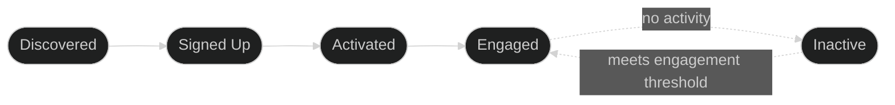
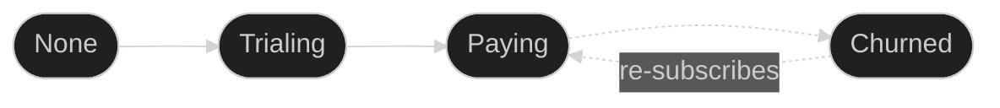

Outlit tracks separate dimensions of your customer relationships as part of the [customer context graph](/concepts/customer-context-graph): **contact journey** (how engaged each person is), **company activation** (whether an account reached its configured value milestone), and **account billing** (the commercial relationship). A contact can be highly engaged while their company has not activated or paid, and a company can remain activated while a specific contact becomes inactive.

## How does Outlit model the customer journey?

Outlit tracks contacts and accounts separately:

### Contact Journey (per person)


```mermaid
%%{init: {'theme': 'dark', 'flowchart': {'nodeSpacing': 50, 'rankSpacing': 60, 'curve': 'basis', 'padding': 15}}}%%
flowchart LR
    A([Discovered]) --> B([Signed Up])
    B --> C([Activated])
    C --> D([Engaged])
    D -.->|no activity| E([Inactive])
    E -.->|meets engagement threshold| D
```

### Account Billing (per company)


```mermaid
%%{init: {'theme': 'dark', 'flowchart': {'nodeSpacing': 50, 'rankSpacing': 60, 'curve': 'basis', 'padding': 15}}}%%
flowchart LR
    F([None]) --> G([Trialing])
    G --> H([Paying])
    H -.-> I([Churned])
    I -.->|re-subscribes| H
```

### Company Activation (per company)

A company activates once when its configured definition first matches. The definition
composes one to three existing customer-grain signals with `ANY`, `ALL`, or `AT_LEAST`
and an optional bounded window. Core evaluates the signals for the same company and
materializes `activatedAt` monotonically: it never automatically unactivates a company.

Use `outlit activation preview` to evaluate a candidate against history without changing
configuration or materializing activation. Use `outlit activation update` only after
review. Activation commands reference existing customer-grain signals; they do not
create signals. Disabling future evaluation preserves existing activation timestamps
and milestones.

Company activation is not a contact journey stage. A contact's `ACTIVATED` stage retains
its existing contact-only meaning and compatibility behavior.

---

## What are the contact journey stages?

Each person (contact) progresses through stages based on their product engagement:

| Stage | Meaning | How It's Set |
|-------|---------|--------------|
| **Discovered** | Email known, hasn't signed up yet | Auto-detected by browser SDK when email is provided without userId |
| **Signed Up** | Created an account | Auto-detected by browser SDK when both email and userId are provided |
| **Activated** | Completed onboarding or key milestone | Derived by Core from your selected ordinary activation event |
| **Engaged** | Actively using the product | Auto-inferred from product activity via PostHog or your SDK (browser/server) |
| **Inactive** | No activity for extended period | Auto-inferred when no activity detected for 30+ days |

<Info>
  Contact stages track **product engagement**, not billing. A contact can be Engaged even if their company hasn't paid, or Inactive even if their company is actively paying.
</Info>

### How stages progress

Contacts move forward through Discovered, Signed Up, Activated, and Engaged. They can never move backwards—an Engaged contact can't become Activated again. The one exception is Inactive: contacts return to Engaged when their activity again meets the configured engagement threshold.

---

## How does Outlit detect stages automatically?

### Discovered vs Signed Up

The difference is determined by the identifiers you provide:

<Tabs>
  <Tab title="Discovered">
    When you identify a visitor with **only an email** (no userId), they're marked as Discovered:

    ```typescript
    outlit.identify({
      email: 'jane@example.com',
      traits: { source: 'newsletter' }
    })
    ```

    Typical triggers: newsletter signup, contact form submission, lead magnet download.
  </Tab>
  <Tab title="Signed Up">
    When you identify a visitor with **both email and userId**, they're marked as Signed Up:

    ```typescript
    outlit.identify({
      email: 'jane@example.com',
      userId: 'usr_12345',
      traits: { plan: 'free' }
    })
    ```

    Typical triggers: account creation, first login, OAuth authentication.
  </Tab>
</Tabs>

<Tip>
  If a Discovered contact later provides a userId (e.g., they sign up after submitting a lead form), they automatically advance to Signed Up.
</Tip>

### Automatic engagement and inactivity

Outlit derives Engaged and Inactive from tracked product activity. Activity signals can come from the browser SDK, server SDK, and connected product integrations. Engagement is based on consistent activity in a configured rolling window; inactivity is based on no qualifying activity for the configured inactivity period.

---

## How is contact activation derived?

<Info>
  Identify the user and send the same ordinary activation event consistently from the browser SDK, server SDK, or a verified product integration.
</Info>

### Track the selected activation event

Choose an ordinary event that represents the product's meaningful value moment, then track it after the action succeeds:

```typescript
outlit.track('onboarding_completed', {
  flow: 'self_serve',
  completedSteps: 3
})
```

Configure `onboarding_completed` (or your equivalent event) as the activation event in Outlit. Core derives Activated from that ordinary event. It also derives Engaged and Inactive from the broader stream of tracked product activity.

---

## What are the account billing statuses?

Each account (company) has a billing status that's separate from individual contact journeys:

| Status | Meaning | How It's Set |
|--------|---------|--------------|
| **None** | Never had a subscription | Default |
| **Trialing** | Active trial period | Verified billing integration |
| **Paying** | Active paid subscription | Verified billing integration |
| **Churned** | Had subscription, now cancelled | Verified billing integration |

---

## How does Stripe integration work?

If you've connected Stripe to Outlit, billing status is handled automatically:

| Stripe Subscription Status | Account Billing Status |
|---------------------------|------------------------|
| `trialing` | Trialing |
| `active` | Paying |
| `canceled` | Churned |
| `unpaid` | Churned |

When a subscription status changes in Stripe, Outlit automatically updates the matching account's billing status. Individual contact journey stages are not affected.

<Info>
  Stripe integration links accounts through synced customer and contact identity. Company-domain accounts and personal-email customers are handled differently, so billing status should be read as account context, not as a contact journey stage.
</Info>

---

## Best practices

**Send facts, not authoritative state.** Discovered and Signed Up are auto-detected from identity. Activated is derived by Core from the customer-selected ordinary activation event. Engaged and Inactive are derived from tracked product activity captured by the browser SDK, server SDK, and verified product integrations. Verified billing integrations provide billing status.

**Understand the separation.** Contact journey, company activation, and account billing are independent. Jane can be Engaged while her company has not activated, or Inactive after her company has activated and paid. Jane's journey can change independently from the company's monotonic activation timestamp and billing status.

**Define company activation from existing signals.** Continue tracking ordinary product
events or ingesting them through connected analytics sources. Configure one to three
customer-grain signals with the activation CLI; do not add a synthetic activation event
or client-side lifecycle state.

**Track activation at the right time.** Send the selected ordinary activation event when the action is confirmed complete, not when the user clicks a button. Wait for the backend to confirm success before tracking.

**Include useful properties.** Properties help you analyze stage transitions. Include context like which onboarding flow was completed, time-to-activate, and which steps were skipped.

---

## Frequently Asked Questions

<AccordionGroup>
  <Accordion title="What's the difference between contact journey and account billing?">
    Contact journey tracks individual people's product engagement (Discovered through Inactive). Account billing tracks the commercial relationship (None through Churned). They're independent — Jane can be Engaged while her company is on a free plan, or Inactive while her company is actively paying.
  </Accordion>

  <Accordion title="What's the difference between contact and company activation?">
    Contact activation is a per-person journey stage derived from the selected ordinary contact activation event. Company activation is a separate, monotonic account milestone derived by Core from one to three customer-grain signals. Company activation is exposed as `activatedAt` and does not rewrite contact journey stages.
  </Accordion>

  <Accordion title="Which stages require manual instrumentation?">
    No journey stage is set through an authoritative SDK command. Discovered and Signed Up are derived from identity, Activated is derived from your selected ordinary activation event, and Engaged and Inactive are derived from tracked product activity. Billing statuses sync from verified billing integrations.
  </Accordion>

  <Accordion title="Can contacts move backward in journey stages?">
    Contacts generally progress forward through Discovered, Signed Up, Activated, and Engaged. The only cycle is Engaged ↔ Inactive, which is driven by activity and inactivity.
  </Accordion>
</AccordionGroup>

---

## Next Steps

<CardGroup cols={2}>
  <Card title="Identity Resolution" icon="fingerprint" href="/concepts/identity-resolution">
    How Outlit connects anonymous visitors to known contacts
  </Card>
  <Card title="Server-Side Tracking" icon="server" href="/tracking/server/nodejs">
    Track ordinary product events from your backend
  </Card>
  <Card title="Browser Integration" icon="browser" href="/tracking/browser/script">
    Set up browser tracking
  </Card>
  <Card title="API Reference" icon="code" href="/api-reference/ingest">
    Direct API for identify and product events
  </Card>
</CardGroup>
