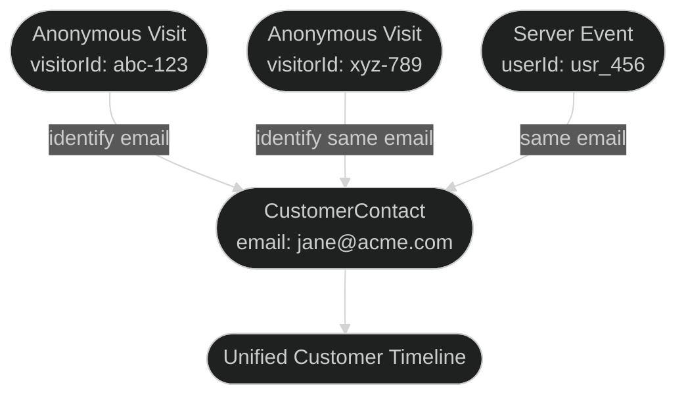

**TL;DR:** Identity resolution is how Outlit links anonymous website visitors to known contacts in the [customer context graph](/concepts/customer-context-graph). When someone browses your site anonymously and later signs up or logs in, Outlit automatically connects their entire history — giving you a complete picture of their journey from first visit to conversion.

## Auto-Identify

By default, Outlit **automatically identifies visitors** when they submit a form containing an email field—no code required.

### How It Works

When a form is submitted, Outlit:

1. **Detects email** by looking for:
   - Field names: `email`, `e-mail`, `user_email`, `emailAddress`
   - Input type: `type="email"`
   - Any field with a valid email value (fallback)

2. **Extracts name** by looking for:
   - Full name: `name`, `full_name`, `fullname`, `your_name`
   - First name: `first_name`, `fname`, `firstname`, `given_name`
   - Last name: `last_name`, `lname`, `surname`, `family_name`

3. **Calls `identify()` automatically**:

```typescript
// This happens behind the scenes when a form with email is submitted
identify({
  email: 'jane@acme.com',
  traits: {
    name: 'Jane Doe',      // If full name found
    firstName: 'Jane',     // If first name found
    lastName: 'Doe'        // If last name found
  }
})
```

<Info>
  The form submission event is still captured separately. Auto-identify adds an additional `identify` event when an email is found.
</Info>

### Disabling Auto-Identify

If you prefer to handle identification manually:

<Tabs>
  <Tab title="Script Tag">
```html
<script
  src="https://cdn.outlit.ai/stable/outlit.js"
  data-public-key="pk_xxx"
  data-auto-identify="false"
  async
></script>
```
  </Tab>
  <Tab title="React">
```tsx
<OutlitProvider publicKey="pk_xxx" autoIdentify={false}>
  {children}
</OutlitProvider>
```
  </Tab>
  <Tab title="NPM">
```typescript
outlit.init({
  publicKey: 'pk_xxx',
  autoIdentify: false
})
```
  </Tab>
</Tabs>

---

## How does identity resolution work?



### Identity Priority

When multiple identifiers exist, Outlit uses this priority order:

| Priority | Identifier Type | Example | Source |
|----------|----------------|---------|--------|
| 1 (Highest) | Email | `jane@acme.com` | Identify call, form submission |
| 2 | External User ID | `usr_12345` | Auth provider (Supabase, Auth0) |
| 3 | Fingerprint | `device_abc123` | Server SDK (device identifier) |
| 4 (Lowest) | Anonymous ID | `abc-def-123` | Browser visitor ID |

### Resolution Process

When you call `identify()`:

1. **Search existing contacts** by provided identifiers
2. **Match found?** Link the anonymous visitor to existing contact
3. **No match?** Create new CustomerContact and Customer
4. **Multiple matches?** Merge profiles, keeping the most complete one

---

## What are the identifier types?

### Email (Primary)

Email is the most reliable identifier because it's unique per person, verified through login/signup, and works across devices.

```typescript
outlit.identify({
  email: 'jane@acme.com', // Primary identifier
  traits: { name: 'Jane' }
})
```

### External User ID

Your application's internal user ID (from Supabase, Auth0, Firebase, etc.):

```typescript
outlit.identify({
  userId: 'usr_12345', // Your auth system's ID
  email: 'jane@acme.com',
  traits: { authProvider: 'auth0' }
})
```

<Tip>
  Always send both `email` and `userId` when available. This creates the strongest identity link.
</Tip>

### Anonymous Visitor ID

Automatically generated for browser visitors:

```typescript
// Generated and stored automatically
const visitorId = outlit.getVisitorId()
// "a1b2c3d4-e5f6-7890-abcd-ef1234567890"
```

This ID is stored in localStorage and cookies, persists across sessions (same browser), and gets linked to CustomerContact after identify.

### Fingerprint (Device ID)

For native apps without browser storage (desktop, mobile, CLI), use a fingerprint—a stable device identifier you generate and manage:

```rust
// Rust SDK
client.track_by_fingerprint("app_opened", fingerprint("device_abc123"))
    .send()
    .await?;

// Later, link to user
client.identify(email("user@example.com"))
    .fingerprint("device_abc123")
    .send()
    .await?;
```

<Tip>
  See [Device Tracking](/concepts/website-visitors#device-tracking-non-browser) for implementation details.
</Tip>

---

## How does profile merging work?

When Outlit detects the same person with different identifiers, profiles are merged.

### Merge Triggers

<AccordionGroup>
  <Accordion title="Same email, different visitor IDs">
    User visits on phone (visitorId: A), then laptop (visitorId: B), identifies with same email on both.

    **Result:** Both visitor histories merge into one CustomerContact.
  </Accordion>

  <Accordion title="Email change / correction">
    User identifies as `jane@old-company.com`, later updates to `jane@new-company.com` while logged into same account (userId).

    **Result:** New email added to contact identifiers, profiles linked.
  </Accordion>

  <Accordion title="Multiple auth methods">
    User signs up with email, later links Google OAuth which has different email.

    **Result:** Both emails link to same contact via shared userId.
  </Accordion>
</AccordionGroup>

### Merge Rules

| Data | Rule |
|------|------|
| Events/Activities | Combined into unified timeline |
| Traits | Newer values overwrite older |
| Identifiers | All identifiers preserved |
| Anonymous history | All visitor events included |

---

## Browser vs Server Identity

<Tabs>
  <Tab title="Browser Tracking">
    **Anonymous visitors are supported**

    - visitorId auto-generated
    - Events stored until identification
    - Later linked via identify() or setUser()

    ```typescript
    // Works without identity
    outlit.track('page_viewed', { page: '/pricing' })

    // Later, when they sign up
    outlit.identify({ email: 'user@example.com' })

    // Or for SPAs, use setUser after authentication
    outlit.setUser({
      email: 'user@example.com',
      userId: 'usr_123'
    })
    ```
  </Tab>
  <Tab title="Server Tracking">
    **Identity required**

    - Every call needs `email` or `userId`
    - Events go directly to the contact
    - For device/app tracking, use `fingerprint` ([learn more](/concepts/website-visitors#device-tracking-non-browser))

    ```typescript
    // Email or userId required
    outlit.track({
      email: 'user@example.com',
      eventName: 'subscription_created'
    })
    ```
  </Tab>
</Tabs>

---

## Best Practices

### 1. Identify Early

Call `identify()` as soon as you have user information:

```typescript
// After login
onLogin(user) {
  outlit.identify({
    email: user.email,
    userId: user.id,
    traits: { plan: user.plan }
  })
}

// After form submission
onFormSubmit(data) {
  outlit.identify({
    email: data.email,
    traits: { source: 'contact_form' }
  })
}
```

### 2. Always Send Both Identifiers

When you have both email and userId, send both:

```typescript
// Good - creates strong identity link
outlit.identify({
  email: user.email,
  userId: user.id,
  traits: { ... }
})

// Less good - single identifier
outlit.identify({
  email: user.email,
  traits: { ... }
})
```

---

## Debugging

<Warning>
  **Common identity issues:**
  - **Events not linking to user:** Ensure `identify()` is called after authentication and that email/userId matches what you expect.
  - **Duplicate customer profiles:** Usually caused by the same person using different emails or missing `userId`. Contact support for manual merge.
  - **Anonymous history not appearing:** The `identify()` call must come from the same browser/device. Background processing may take up to 5 minutes.
</Warning>

---

## Next Steps

<CardGroup cols={2}>
  <Card title="Website Visitors" icon="globe" href="/concepts/website-visitors">
    Deep dive into the anonymous phase
  </Card>
  <Card title="API Reference" icon="code" href="/api-reference/ingest">
    Direct API for custom integrations
  </Card>
</CardGroup>
