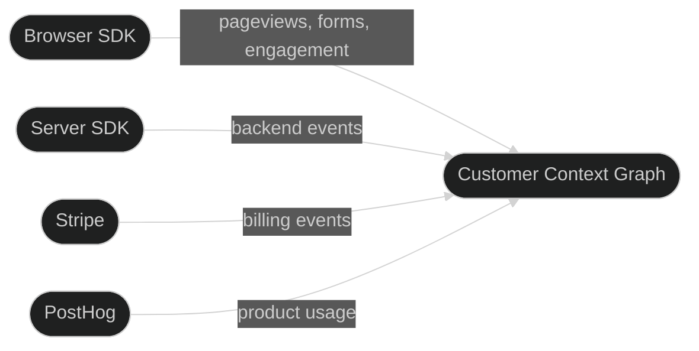

Outlit builds a [customer context graph](/concepts/customer-context-graph) from every customer interaction — website visits, product usage, billing events, and more. Here's how data flows from collection to queryable context.

## 1. Collect

Data enters the graph from multiple sources:



**Browser SDK** — The primary data source for most teams. Once installed, it automatically captures pageviews, form submissions, engagement time, UTM attribution, and company enrichment via IP lookup. No additional code needed for these basics.

**Server SDK** — For backend events where users are already authenticated: subscription lifecycle events, API usage, report generation, and anything that happens outside the browser.

**Stripe** — When connected, billing events sync automatically. Subscription status changes (trialing, active, canceled) update account billing status in real time.

**PostHog** — When connected, product usage sessions feed into the graph, contributing to automatic engagement and inactivity detection.

## 2. Resolve

Most visitors browse your site anonymously before identifying themselves. [Identity resolution](/concepts/identity-resolution) bridges that gap:

1. **Anonymous phase** — Outlit generates a visitor ID and tracks behavior from the first pageview
2. **Identification trigger** — A visitor submits a form with their email, signs up, or logs in
3. **Profile linking** — The anonymous visitor's entire history is connected to their contact profile
4. **Cross-device merging** — When the same person identifies on multiple devices, profiles merge automatically

This happens without code when forms contain an email field (auto-identify). For JavaScript-based auth, call `identify()` after login.

<Info>
  For details on the anonymous phase — what's captured, how visitor IDs work, and company enrichment — see [Website Visitors](/concepts/website-visitors).
</Info>

## 3. Build the Graph

As data flows in and identities resolve, Outlit structures it into entities and relationships:

**Entities:**
- **Visitors** — Anonymous browsing sessions, identified by visitor ID or device fingerprint
- **Contacts** — Known people, identified by email and/or user ID
- **Accounts** — Companies, identified by domain, with billing status from Stripe

**Relationships:**
- Visitors link to contacts via identity resolution
- Contacts belong to accounts via email domain matching
- All activity flows into a unified timeline per contact and account

**Journey stages** are properties maintained on these entities:
- Contacts carry a journey stage: Discovered → Signed Up → Activated → Engaged → Inactive
- Accounts carry a billing status: None → Trialing → Paying → Churned

The Outlit browser SDK auto-detects **Discovered** (email known, no userId) and **Signed Up** (both email and userId provided). **Engaged** and **Inactive** are auto-inferred from product activity via PostHog or your SDK. **Activated** is the one stage you call manually — `user.activate()` — because the definition of activation is specific to your product. Billing statuses update automatically when Stripe is connected.

<Info>
  For the full breakdown of journey stages and billing statuses, see [Customer Journey](/concepts/customer-journey).
</Info>

## 4. Query

The complete graph is accessible through three interfaces:

### CLI

```bash
# List paying customers sorted by revenue
outlit customers list --billing-status PAYING --sort mrr

# Get a customer profile with timeline
outlit customers get acme.com --include users,revenue,timeline

# Natural language search
outlit search "customers who signed up from Google Ads last month"

# SQL
outlit sql "SELECT domain, mrr_cents FROM customers WHERE billing_status = 'PAYING'"
```

### AI Agents (MCP)

Configure your AI agent to query customer context directly:

```bash
outlit setup --yes
```

Then in Cursor, Claude Code, or VS Code, your AI agent can ask questions about customers, get timelines, search context, and run SQL — all powered by the same graph.

### REST API

For custom integrations, the [Ingest API](/api-reference/ingest) accepts events from any source, and query endpoints expose the graph programmatically.

---

## Privacy and Security

<CardGroup cols={2}>
  <Card title="Form Sanitization" icon="shield">
    Sensitive fields (password, SSN, credit card) are automatically stripped from form submissions.
  </Card>
  <Card title="Domain Allowlist" icon="lock">
    Configure which domains can send events to prevent unauthorized tracking.
  </Card>
  <Card title="No PII in URLs" icon="eye-slash">
    Query parameters with sensitive patterns are automatically redacted.
  </Card>
  <Card title="GDPR Ready" icon="scale-balanced">
    Built-in support for consent management, data deletion, and export requests.
  </Card>
</CardGroup>

---

## Frequently Asked Questions

<AccordionGroup>
  <Accordion title="What does Outlit track automatically vs what do I need to instrument?">
    The browser SDK automatically captures pageviews, form submissions, engagement time, UTM attribution, and company enrichment. Identity is auto-detected from forms with email fields. You only need to manually call `identify()` for JavaScript-based auth (OAuth, magic links), `user.activate()` for activation milestones, and `track()` for custom business events.
  </Accordion>

  <Accordion title="How long before data appears in the graph?">
    Browser and server SDK events appear within seconds. Stripe webhooks process within minutes. PostHog syncs run on a configurable schedule.
  </Accordion>

  <Accordion title="Can I use Outlit without Stripe or PostHog?">
    Yes. The browser SDK alone gives you website tracking, identity resolution, and journey stages. Each integration adds more signal but none are required.
  </Accordion>
</AccordionGroup>

---

## Next Steps

<CardGroup cols={2}>
  <Card title="Quick Start" icon="rocket" href="/tracking/quickstart">
    Install the CLI and add tracking in 5 minutes
  </Card>
  <Card title="Customer Context Graph" icon="circle-nodes" href="/concepts/customer-context-graph">
    Deep dive into the unified data model
  </Card>
  <Card title="Identity Resolution" icon="fingerprint" href="/concepts/identity-resolution">
    How profiles are linked across devices and sources
  </Card>
  <Card title="Customer Journey" icon="route" href="/concepts/customer-journey">
    Journey stages and billing statuses explained
  </Card>
</CardGroup>
