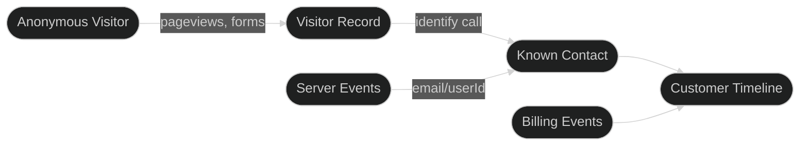

Outlit tracks visitors from their first anonymous pageview through to becoming paying customers. It assigns each visitor a unique ID, captures their behavior automatically, and links everything together when they identify themselves via form submission, login, or signup.

## Why unified tracking matters

Most businesses track customer data in silos:

- **Website analytics** shows anonymous pageviews
- **Product analytics** shows authenticated user behavior
- **Billing** shows payment events

These disconnected systems make it impossible to answer questions like "Which marketing channel brings customers who actually pay?" or "What content did our best customers engage with before signing up?"

Outlit connects all of these into a unified customer timeline.

## How the pieces fit together

## What happens when a visitor lands on your site?

When someone visits your website, Outlit immediately begins tracking:

1. **Generates a visitor ID** - A unique identifier stored in localStorage and cookies that persists across sessions
2. **Captures behavior automatically**:
   - Pageviews (URL, title, referrer)
   - Form submissions (with sensitive field sanitization)
   - UTM parameters and first-touch attribution
   - Engagement time (active time on each page)
3. **Stores events** linked to the anonymous visitor ID

At this stage, you know *what* visitors do, but not *who* they are. All events are tied to the anonymous visitor ID, waiting to be linked to a real person.

## How does Outlit connect anonymous visitors to known users?

When a visitor identifies themselves—through signup, login, or submitting a form with their email—Outlit resolves their identity:

1. **Creates or finds a contact** using the email or user ID provided
2. **Links the anonymous visitor** to that contact
3. **Converts historical events** into the customer timeline
4. **Merges profiles** if the same person used different devices or browsers

This happens automatically when forms contain an email field, or manually when you call `identify()` in your code.

<Info>
  For a deep dive into how identity resolution works, including handling multiple devices and profile merging, see [Identity Resolution](/concepts/identity-resolution).
</Info>

## What about server-side tracking?

For backend events where users are already authenticated:

1. **Skip the anonymous phase** - Users are already known to your system
2. **Emit events directly** to the contact using their email or user ID
3. **Every call requires identity** - No anonymous server events

Server-side tracking is ideal for:
- Subscription lifecycle events (trial started, payment received, churned)
- Backend actions (report generated, export completed)
- Events from systems without browser access

<Info>
  See [Server-Side Tracking](/tracking/server/nodejs) for implementation details and SDK options.
</Info>

## Privacy and security

<CardGroup cols={2}>
  <Card title="Form Sanitization" icon="shield">
    Sensitive fields (password, SSN, credit card) are automatically stripped from form submissions.
  </Card>
  <Card title="Domain Allowlist" icon="lock">
    Configure which domains can send events to prevent unauthorized tracking.
  </Card>
  <Card title="No PII in URLs" icon="eye-slash">
    Query parameters with sensitive patterns are automatically redacted.
  </Card>
  <Card title="GDPR Ready" icon="scale-balanced">
    Built-in support for data deletion and export requests.
  </Card>
</CardGroup>

## Next steps

<CardGroup cols={2}>
  <Card title="Quick Start" icon="rocket" href="/tracking/quickstart">
    Set up tracking in 5 minutes
  </Card>
  <Card title="Identity Resolution" icon="fingerprint" href="/concepts/identity-resolution">
    Deep dive into how profiles are connected
  </Card>
  <Card title="Anonymous Visitors" icon="user-secret" href="/concepts/anonymous-tracking">
    Understand the pre-identification phase
  </Card>
  <Card title="Stages & Billing" icon="chart-line" href="/concepts/customer-journey">
    Track customer lifecycle progression
  </Card>
</CardGroup>
