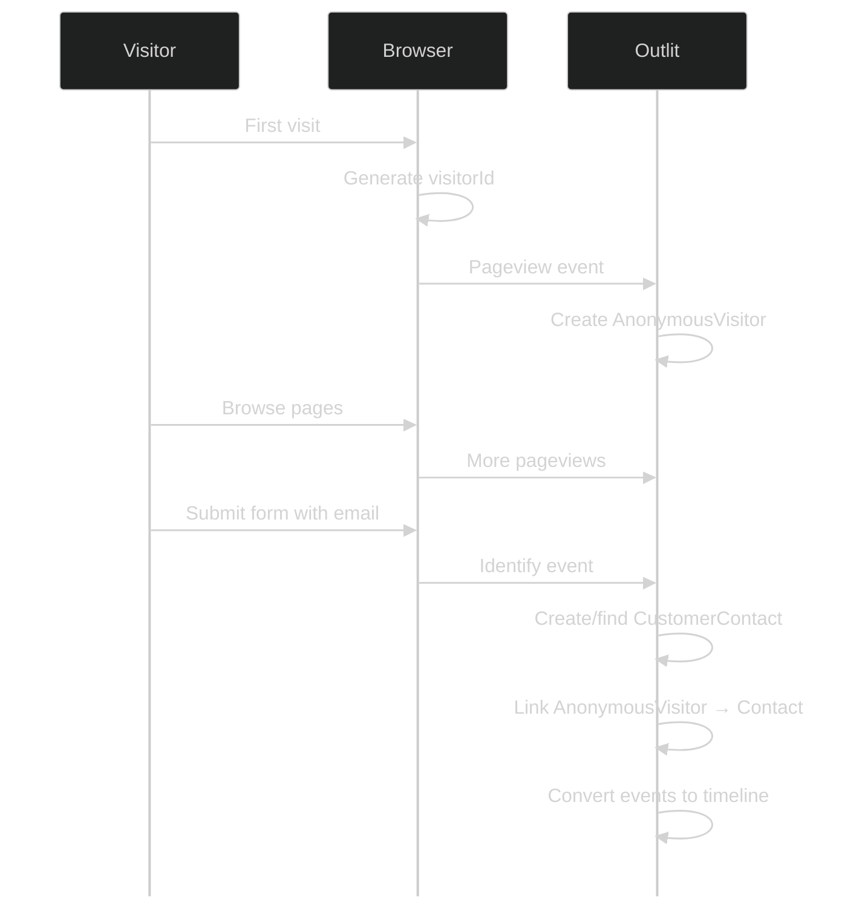
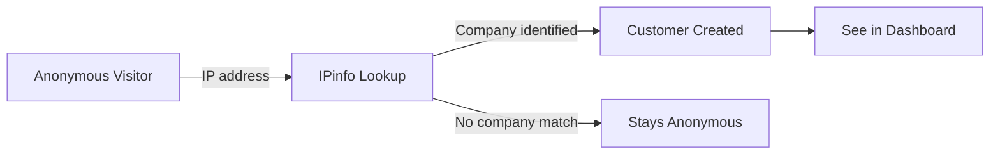
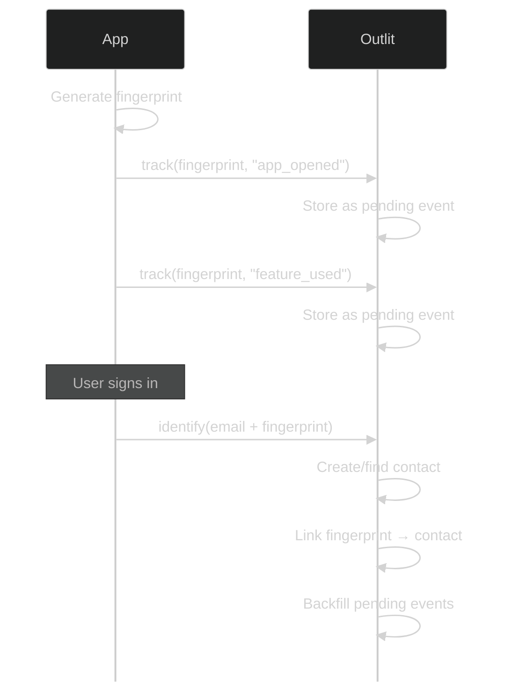

## Overview

Before visitors sign up or log in, they're anonymous. Outlit tracks their behavior and later connects it to their profile when they identify themselves.

## The Anonymous Phase

When someone visits your website for the first time:

1. **Visitor ID generated** - A UUID stored in localStorage and cookies
2. **Session begins** - First-touch attribution captured (UTM, referrer)
3. **Events tracked** - Pageviews, form views, button clicks
4. **Stored as AnonymousVisitor** - Ready to be linked later



## What's Captured

### Automatic Attribution

On first visit, Outlit captures:

| Data | Source | Example |
|------|--------|---------|
| UTM Source | URL params | `utm_source=google` |
| UTM Medium | URL params | `utm_medium=cpc` |
| UTM Campaign | URL params | `utm_campaign=spring_2024` |
| First Referrer | HTTP header | `https://google.com` |
| First Landing Page | URL | `/pricing?plan=pro` |
| IP Address | Request | For company enrichment |

### Events Stored

All events are stored for anonymous visitors and will be linked when they identify:

```typescript
// All these are tracked for anonymous visitors
outlit.track('pricing_viewed', { plan: 'enterprise' })
outlit.track('demo_video_played', { duration: 120 })
outlit.track('feature_explored', { feature: 'integrations' })
```

### Form Data

Form submissions are captured with automatic sanitization:

```json
{
  "type": "form",
  "formId": "contact-form",
  "formFields": {
    "email": "jane@acme.com",
    "name": "Jane",
    "company": "Acme Inc"
  }
}
```

<Note>
  Sensitive fields (password, credit_card, SSN, etc.) are automatically removed from form data.
</Note>

## Visitor ID Storage

The visitor ID is stored in two places for redundancy:

### localStorage

```javascript
// Key: outlit_visitor_id
// Value: "a1b2c3d4-e5f6-7890-abcd-ef1234567890"
localStorage.getItem('outlit_visitor_id')
```

### Cookie

```
outlit_visitor_id=a1b2c3d4-e5f6-7890-abcd-ef1234567890; 
expires=<1 year>; 
path=/; 
SameSite=Lax
```

<Info>
  The cookie enables cross-subdomain tracking (e.g., `www.example.com` → `app.example.com`) and works when localStorage is blocked.
</Info>

## Identity Resolution

When `identify()` is called, the anonymous history is linked:

```typescript
// This triggers identity resolution
outlit.identify({
  email: 'jane@acme.com',
  traits: { name: 'Jane Doe' }
})
```

### What Happens

1. **Find or create contact** with the provided email
2. **Link the anonymous visitor** to the contact
3. **Historical events are processed**:
   - All previous events are added to the customer timeline
   - Original timestamps are preserved
   - The complete journey is now visible

### Timeline After Resolution

```
Jane Doe (jane@acme.com) - Customer Timeline
├── Mar 1, 10:00am - First visited /pricing (anonymous)
├── Mar 1, 10:05am - Viewed enterprise plan (anonymous)
├── Mar 1, 10:10am - Watched demo video (anonymous)
├── Mar 3, 2:00pm  - Returned, viewed /features (anonymous)
├── Mar 3, 2:15pm  - Submitted contact form ← IDENTIFIED
├── Mar 3, 2:20pm  - Viewed /signup
└── Mar 3, 2:25pm  - Created account
```

## Cross-Device Behavior

Anonymous tracking is per-browser. The same person on different devices has different visitor IDs until identified:

```
Phone Browser:    visitorId: "phone-abc-123"
Laptop Browser:   visitorId: "laptop-xyz-789"

After identify(email: "jane@acme.com") on both:
→ Both histories merge into Jane's profile
```

## Session Management

### New Sessions

A new session starts when:
- 30+ minutes of inactivity (configurable)
- Browser closed and reopened
- New day (midnight UTC)

### Session Data

Each session tracks:
- Session start time
- Pages viewed in session
- Session duration
- Conversion events

## Company Enrichment

For B2B companies, knowing *which companies* are visiting your website—even before anyone fills out a form—is valuable sales intelligence. Outlit can automatically identify the company behind anonymous visitors.

### How It Works

When a visitor lands on your site:

1. **IP address is captured** with the first pageview
2. **Company lookup runs** in the background using [IPinfo](https://ipinfo.io)
3. **If a company is identified**, a new customer record is created in your dashboard
4. **Browsing activity is linked** so you can see what pages they viewed

<Frame>

</Frame>

### What You'll See

When enrichment succeeds, you'll find a new customer in your dashboard with:

- **Company name and domain** from the IP lookup
- **First landing page** showing where they entered your site
- **Attribution data** like referrer and UTM parameters

This gives you visibility into companies showing interest—before they've even reached out.

### Privacy by Design

We intentionally **do not deanonymize individual visitors**. Company enrichment tells you "someone from Acme Inc visited your pricing page"—not *who* that person is.

This approach:

- **Respects individual privacy** - No attempt to identify the specific person
- **Focuses on company-level signals** - Which is what matters for B2B sales
- **Filters out noise** - ISPs, VPNs, and low-confidence matches are excluded
- **Only uses IP for company lookup** - The raw IP address is not stored after enrichment

<Info>
  Since enrichment only reveals company-level information, no individual contact is created. A contact is only created when someone actively identifies themselves (form submission, signup, etc.).
</Info>

### When Enrichment Happens

Not every visitor can be enriched. Outlit only creates a customer record when:

- The IP address maps to a **business, education, or government network**
- The match confidence is **high enough** to be reliable
- The company has a **valid domain** we can associate

Visitors from residential ISPs, coffee shops, VPNs, or hosting providers are intentionally excluded to avoid false positives.

<Note>
  Company enrichment is available on certain plans. Contact us to enable it for your workspace.
</Note>

## Handling Edge Cases

### Cleared Cookies/Storage

If a visitor clears their browser data:
- New visitorId generated
- Previous anonymous history orphaned
- Can only link if they identify again

<Tip>
  Consider using `identify()` immediately after login, even for returning users, to ensure continuity.
</Tip>

### Private/Incognito Browsing

- New visitorId per session
- localStorage may be cleared on close
- Cookie may not persist
- History captured but may not link

### Multiple People, Same Browser

If multiple people use the same browser:
- Same visitorId used
- Events mixed together
- Identify separates them (by email)

Best practice: Encourage users to log in for accurate tracking.

## Accessing Anonymous Data

### Get Current Visitor ID

```typescript
// Browser SDK
const visitorId = outlit.getVisitorId()
```

### Send to Your Backend

```typescript
// Send visitor ID for server-side correlation
fetch('/api/track', {
  headers: {
    'X-Outlit-Visitor-ID': outlit.getVisitorId()
  },
  body: JSON.stringify({ action: 'viewed_pricing' })
})
```

## Privacy Considerations

### Data Retention

Anonymous visitor data is retained for:
- **Unidentified visitors**: 90 days (configurable)
- **Identified visitors**: Linked to customer, retained per your policy

### GDPR Compliance

- Anonymous data can be deleted on request
- Visitor ID is pseudonymous (not directly identifying)
- IP addresses used only for company lookup
- No cross-site tracking

### Opt-Out

Respect user preferences:

```typescript
// Check for opt-out preference
if (!hasTrackingConsent()) {
  // Don't initialize tracker
  return
}

outlit.init({ publicKey: 'pk_xxx' })
```

## Device Tracking (Non-Browser)

For native apps without browser storage (desktop apps, mobile apps, CLI tools), use `fingerprint` instead of `visitorId`. A fingerprint is a device identifier that you generate and manage.

### When to Use Fingerprint

| Environment | Use |
|-------------|-----|
| Desktop apps (Tauri, Electron) | `fingerprint` |
| Mobile apps (React Native) | `fingerprint` |
| CLI tools | `fingerprint` |
| Browser/Webview | `visitorId` (automatic) |

### How It Differs from visitorId

| | visitorId | fingerprint |
|--|-----------|-------------|
| Generated by | SDK (automatic) | You (manual) |
| Stored in | localStorage + cookies | Your app (you decide) |
| SDKs | Browser SDK | Rust SDK, Node SDK |

### Generating a Fingerprint

Use any persistent, unique identifier for the device or installation:

- **Device UUID** - Hardware identifier
- **Installation ID** - Generated on first app launch, stored in app data
- **Keychain/Secure storage** - For sensitive apps

The fingerprint must be:
- Consistent across app sessions
- Unique per device/installation
- Stored persistently by your app

### Example: Tracking Before Sign-In

<Tabs>
  <Tab title="Rust (Tauri)">
```rust
use outlit::{Outlit, fingerprint, email};

// Get or generate device fingerprint (store in app data)
let device_id = get_or_create_device_id();

// Track anonymously
client.track_by_fingerprint("feature_used", fingerprint(&device_id))
    .property("feature", "export")
    .send()
    .await?;

// Later, when user signs in
client.identify(email("user@example.com"))
    .fingerprint(&device_id)
    .send()
    .await?;
// ^ All previous fingerprint events are now linked to this user
```
  </Tab>
  <Tab title="Node.js (React Native)">
```typescript
import { Outlit } from '@outlit/node'

// Get or generate device fingerprint
const deviceId = await getOrCreateDeviceId()

// Track anonymously
outlit.track({
  fingerprint: deviceId,
  eventName: 'feature_used',
  properties: { feature: 'export' }
})

// Later, when user signs in
outlit.identify({
  email: 'user@example.com',
  fingerprint: deviceId
})
// ^ All previous fingerprint events are now linked to this user
```
  </Tab>
</Tabs>

### How Linking Works



<Info>
  Events tracked with only a fingerprint are stored but not visible in customer timelines until linked via `identify()`. Once linked, they appear with their original timestamps.
</Info>

## Next Steps

<CardGroup cols={2}>
  <Card title="Identity Resolution" icon="fingerprint" href="/tracking/identity/overview">
    How profiles are merged across identifiers
  </Card>
  <Card title="Browser Tracking" icon="browser" href="/tracking/browser/script">
    Detailed browser integration guide
  </Card>
</CardGroup>

