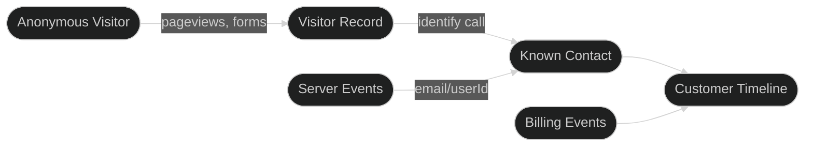

## The Customer Journey Problem

Most businesses track customer data in silos:
- **Website analytics** shows anonymous pageviews
- **Product analytics** shows authenticated user behavior
- **Billing** shows payment events

Outlit connects all of these into a unified customer timeline.

## How Outlit Tracking Works



### Browser Tracking (Anonymous Phase)

When a visitor lands on your website, Outlit:

1. **Generates a visitor ID** - A unique identifier stored in localStorage and cookies
2. **Captures automatically**:
   - Pageviews (URL, title, referrer)
   - Form submissions (with sensitive field sanitization)
   - UTM parameters and first-touch attribution
   - Engagement time (active time on each page)
3. **Stores events** until identification

### Identity Resolution

When a visitor identifies themselves (signup, login, form submission with email), Outlit:

1. **Creates or finds a contact** using the email or user ID
2. **Links the anonymous visitor** to the contact
3. **Converts historical events** to the customer timeline
4. **Merges profiles** if the same person used different devices

### Server-Side Tracking

For authenticated users in your backend:

1. **Skip the anonymous phase** - Users are already known
2. **Emit events directly** to the contact
3. **Require identity** - Email or user ID on every call

## Event Types

### Automatic Events

These are captured automatically by the browser tracker:

| Event | When | Data Captured |
|-------|------|---------------|
| `pageview` | Every navigation | URL, path, title, referrer, UTM |
| `form` | Form submission | Form ID, field values (sanitized) |
| `identify` | Form with email field | Email, name (auto-extracted) |
| `engagement` | Page exit or navigation | Active time, total time, session ID |
| `calendar` | Cal.com/Calendly booking | Provider, event type, time, duration |

<Tip>
  **Auto-Identify:** When a form contains an email field, Outlit automatically calls `identify()` with the extracted email and name. This links the anonymous visitor to a known profile without any code. [Learn more](/tracking/identity/overview#auto-identify)
</Tip>

### Manual Events

Track custom events that matter to your business:

```typescript
// Track a custom event
outlit.track('pricing_page_viewed', {
  plan: 'pro',
  source: 'header_nav'
})

// Identify a visitor
outlit.identify({
  email: 'user@example.com',
  traits: {
    name: 'Jane Doe',
    company: 'Acme Inc'
  }
})
```

### Contact Stage Events

Track contact progression through your product lifecycle:

```typescript
// After user completes onboarding
outlit.user.activate({ flow: 'onboarding' })

// When user reaches an engagement milestone
outlit.user.engaged({ milestone: 'first_project' })
```

<Info>
  Contact stage events require the user to be identified first (via `identify()` or `setUser()`). The `discovered` and `signed_up` stages are automatically inferred from identify calls. Account billing (`trialing`, `paying`, `churned`) is tracked separately—see [Stages & Billing](/tracking/stages).
</Info>

## Privacy & Security

<CardGroup cols={2}>
  <Card title="Form Sanitization" icon="shield">
    Sensitive fields (password, SSN, credit card) are automatically stripped from form submissions.
  </Card>
  <Card title="Domain Allowlist" icon="lock">
    Configure which domains can send events to prevent unauthorized tracking.
  </Card>
  <Card title="No PII in URLs" icon="eye-slash">
    Query parameters with sensitive patterns are automatically redacted.
  </Card>
  <Card title="GDPR Ready" icon="scale-balanced">
    Built-in support for data deletion and export requests.
  </Card>
</CardGroup>

## Next Steps

<Columns cols={2}>
  <Card title="Quick Start" icon="rocket" href="/tracking/quickstart">
    Set up tracking in 5 minutes
  </Card>
  <Card title="Browser Tracking" icon="browser" href="/tracking/browser/script">
    Learn about browser integration options
  </Card>
  <Card title="Server-Side" icon="server" href="/tracking/server/nodejs">
    Track events from your backend
  </Card>
  <Card title="Identity" icon="fingerprint" href="/tracking/identity/overview">
    Understand identity resolution
  </Card>
</Columns>
