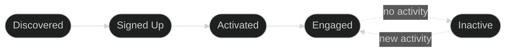
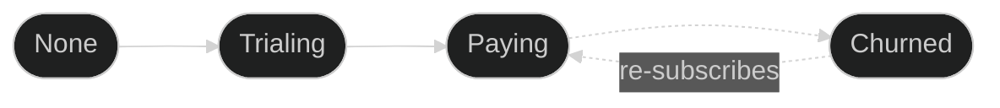

## Overview

Outlit tracks two independent dimensions of your customer relationships:

1. **Contact Journey** - How engaged is each person with your product?
2. **Account Billing** - Does this company pay you?

These are tracked separately because they're independent. A contact can be highly engaged while their company hasn't paid yet, or a company can be paying while a specific team member is inactive.

### Contact Journey (per person)



### Account Billing (per company)



---

## Contact Journey Stages

Each person (contact) progresses through stages based on their product engagement:

| Stage | Meaning | How It's Set |
|-------|---------|--------------|
| **Discovered** | Email known, hasn't signed up yet | Automatic |
| **Signed Up** | Created an account | Automatic |
| **Activated** | Completed onboarding or key milestone | Call `user.activate()` |
| **Engaged** | Actively using the product | Automatic or `user.engaged()` |
| **Inactive** | No activity for extended period | Automatic |

<Info>
  Contact stages track **product engagement**, not billing. A contact can be Engaged even if their company hasn't paid, or Inactive even if their company is actively paying.
</Info>

### How Stages Progress

- Contacts move forward through Discovered → Signed Up → Activated → Engaged
- Contacts can never move backwards (Engaged can't become Activated)
- Inactive contacts automatically return to Engaged when they have new activity

### Automatic Stage Detection

#### Discovered vs Signed Up

The difference is determined by the identifiers you provide:

<Tabs>
  <Tab title="Discovered">
    When you identify a visitor with **only an email** (no userId), they're marked as Discovered:

    ```typescript
    outlit.identify({
      email: 'jane@example.com',
      traits: { source: 'newsletter' }
    })
    ```

    Typical triggers:
    - Newsletter signup
    - Contact form submission
    - Lead magnet download
  </Tab>
  <Tab title="Signed Up">
    When you identify a visitor with **both email and userId**, they're marked as Signed Up:

    ```typescript
    outlit.identify({
      email: 'jane@example.com',
      userId: 'usr_12345',
      traits: { plan: 'free' }
    })
    ```

    Typical triggers:
    - Account creation
    - First login
    - OAuth authentication
  </Tab>
</Tabs>

<Tip>
  If a Discovered contact later provides a userId (e.g., they sign up after submitting a lead form), they automatically advance to Signed Up.
</Tip>

#### Automatic Engagement

Outlit monitors user activity and automatically advances contacts to Engaged when they show consistent usage—active on multiple distinct days within a rolling time window.

You don't need to call `user.engaged()` manually in most cases. However, you can call it explicitly for specific milestones:

```typescript
outlit.user.engaged({ milestone: 'completed_first_project' })
```

#### Automatic Inactivity

Outlit automatically marks contacts as Inactive when they haven't had any product activity for an extended period (default: 30 days). When an inactive contact returns and has new activity, they automatically recover to Engaged.

<Info>
  Inactivity is about product engagement, not billing. If someone stops using your product but their company is still paying, they'll be marked Inactive while the account remains Paying.
</Info>

### Manual Stage Methods

#### user.activate()

Mark a contact as activated after they complete onboarding:

```typescript
outlit.user.activate({
  flow: 'onboarding',
  completedSteps: ['profile', 'first_action', 'invite_team']
})
```

**When to call:**
- User completes your onboarding flow
- User performs a key "aha moment" action
- User reaches your definition of activation

#### user.engaged()

While engagement is calculated automatically, you can explicitly mark it for specific milestones:

```typescript
outlit.user.engaged({
  milestone: 'power_user',
  actionsThisWeek: 50
})
```

---

## Account Billing Status

Each account (company) has a billing status that's separate from individual contact journeys:

| Status | Meaning | How It's Set |
|--------|---------|--------------|
| **None** | Never had a subscription | Default |
| **Trialing** | Active trial period | Automatic (Stripe) or manual |
| **Paying** | Active paid subscription | Automatic (Stripe) or manual |
| **Churned** | Had subscription, now cancelled | Automatic (Stripe) or manual |

### Automatic Billing via Stripe

If you've connected Stripe to Outlit, billing status is handled automatically:

| Stripe Subscription Status | Account Billing Status |
|---------------------------|------------------------|
| `trialing` | Trialing |
| `active` | Paying |
| `canceled` | Churned |
| `unpaid` | Churned |

When a subscription status changes in Stripe, Outlit automatically updates the account's billing status. Individual contact journey stages are not affected.

<Info>
  Stripe integration links accounts via email matching. When Outlit syncs a Stripe customer, it finds the matching account and updates its billing status.
</Info>

### Manual Billing Methods

For non-Stripe payment processors or custom billing logic:

```typescript
// When a trial starts
outlit.customer.trialing({
  domain: 'acme.com',
  trialEndsAt: '2024-02-15'
})

// When payment succeeds
outlit.customer.paid({
  domain: 'acme.com',
  plan: 'pro',
  amount: 99
})

// When subscription is cancelled
outlit.customer.churned({
  domain: 'acme.com',
  reason: 'too_expensive'
})
```

<Note>
  Billing methods target the account by domain, not individual contacts. All contacts under that account share the same billing status.
</Note>

---

## Server-Side Usage

Stage methods are also available in the server SDK:

### Contact Journey (Server)

```typescript
import { Outlit } from '@outlit/node'

const outlit = new Outlit({ publicKey: 'pk_xxx' })

// After user completes onboarding
outlit.user.activate({
  email: 'jane@example.com',
  properties: { flow: 'onboarding' }
})

// When user hits engagement milestone
outlit.user.engaged({
  userId: 'usr_12345',
  properties: { milestone: 'first_project_created' }
})
```

### Account Billing (Server)

```typescript
// After successful Stripe payment (if not using auto-sync)
outlit.customer.paid({
  domain: 'acme.com',
  properties: {
    plan: 'pro',
    amount: 99
  }
})

// When subscription is cancelled
outlit.customer.churned({
  domain: 'acme.com',
  properties: {
    reason: 'cancelled_by_user'
  }
})
```

---

## Best Practices

### Let Automatic Detection Work

Don't over-instrument. Outlit handles most stage transitions automatically:

```typescript
// Good: Let Outlit determine stages
outlit.identify({ email: 'user@example.com' }) // → Discovered
outlit.identify({ email: 'user@example.com', userId: 'usr_123' }) // → Signed Up
// Engagement and inactivity are calculated automatically
// Stripe handles billing status automatically
```

### Understand the Separation

Contact journey and account billing are independent:

| Scenario | Contact Stage | Account Billing |
|----------|---------------|-----------------|
| Jane signs up, company hasn't paid | Signed Up | None |
| Jane is active, company starts trial | Engaged | Trialing |
| Jane is active, company pays | Engaged | Paying |
| Jane stops using product, company still pays | Inactive | Paying |
| Jane returns, company still pays | Engaged (auto-recovery) | Paying |
| Company cancels, Jane still logs in | Engaged | Churned |

### Call Stage Methods at the Right Time

Stage methods should be called when the action is **confirmed**:

```typescript
// Bad: Called when user clicks "Complete"
function handleOnboardingClick() {
  outlit.user.activate() // Too early!
  completeOnboarding()
}

// Good: Called after onboarding is confirmed complete
async function handleOnboardingComplete() {
  await saveOnboardingProgress()
  outlit.user.activate({ flow: 'onboarding_v2' })
}
```

### Include Useful Properties

Properties help you analyze stage transitions:

```typescript
// Sparse — hard to analyze
outlit.user.activate()

// Rich — enables funnel analysis
outlit.user.activate({
  flow: 'onboarding_v2',
  timeToActivate: 3600,
  completedSteps: ['profile', 'first_project'],
  skippedSteps: ['invite_team']
})
```

---

## Viewing in the Dashboard

- **Customer list**: Filter by billing status, see account-level metrics
- **Funnel reports**: Analyze conversion between stages and measure time-to-convert

---

## Next Steps

<CardGroup cols={2}>
  <Card title="Identity Resolution" icon="fingerprint" href="/tracking/identity/overview">
    How Outlit connects anonymous visitors to known contacts
  </Card>
  <Card title="Server-Side Tracking" icon="server" href="/tracking/server/nodejs">
    Track stage events from your backend
  </Card>
  <Card title="Browser Integration" icon="browser" href="/tracking/browser/script">
    Set up browser tracking
  </Card>
  <Card title="API Reference" icon="code" href="/api-reference/ingest">
    Direct API for stage events
  </Card>
</CardGroup>
